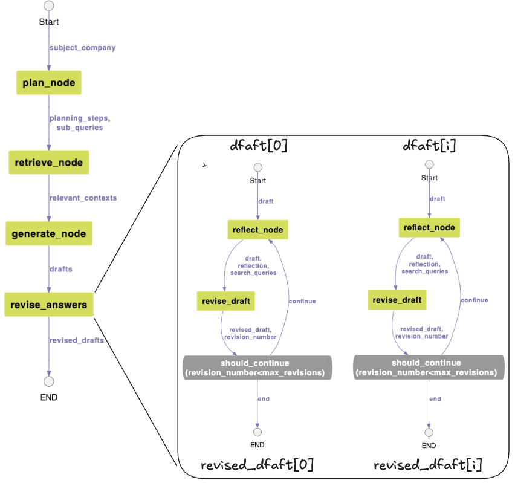
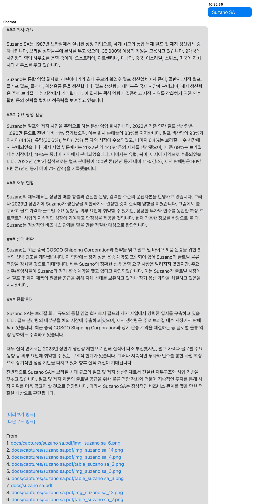

# Agent를 이용한 기업 정보 요약 서비스 구현하기

<p align="left">
    <a href="https://hits.seeyoufarm.com"></a>
    
</p>

여기에서는 기업의 정보를 PDF 문서로 받아서 원하는 목차로 정리하는 업무지원 프로세스에 대해 설명합니다. PDF 문서를 활용하기 위해서는 문서의 주제와 생성일에 대한 정보를 추출해 문서 chunk의 metadata로 등록하는 절차가 필요합니다. 또한 이때의 메타정보를 기준으로 문서를 검색하기 위해서는 RAG의 지식저장소가 필요합니다. 그리고 얻어진 문서의 내용을 사용자가 원하는 포맷으로 보여줄수 있도록 markdown로 정리하고 html로 공유할 수 있어야 합니다. 여기서는 PDF에서 정보의 추출 및 메타정보로 등록, RAG를 이용한 문서의 검색, markdown형태로 문서를 공유하는 일련의 과정을 설명합니다.

기업 정보 요약을 위한 인프라는 Amazon serverless architecture 패턴을 따라 아래와 같이 설계되었습니다. 이러한 architecture는 변화하는 트래픽에 적절히 대응하고 비용을 최적화할 수 있습니다. 또한 AWS CDK를 이용해 편리하게 배포할 수 있습니다. 


## OpenSearch를 이용한 RAG의 구현

LangChain의 [OpenSearchVectorSearch](https://api.python.langchain.com/en/latest/vectorstores/langchain_community.vectorstores.opensearch_vector_search.OpenSearchVectorSearch.html)을 이용하여 지식저장소인 Amazon OpenSearch와 연결합니다. 이후 계층적 chunking을 이용하여 관련된 문서를 조회합니다. 

```python
def get_answer_using_opensearch(chat, text, connectionId, requestId):    
    global reference_docs
    
    msg = ""
    top_k = 4
    relevant_docs = []
    
    bedrock_embedding = get_embedding()
       
    vectorstore_opensearch = OpenSearchVectorSearch(
        index_name = index_name,
        is_aoss = False,
        ef_search = 1024, # 512(default)
        m=48,
        #engine="faiss",  # default: nmslib
        embedding_function = bedrock_embedding,
        opensearch_url=opensearch_url,
        http_auth=(opensearch_account, opensearch_passwd), # http_auth=awsauth,
    )  
    
    if enalbeParentDocumentRetrival == 'true': # parent/child chunking
        relevant_documents = get_documents_from_opensearch(vectorstore_opensearch, text, top_k)
                        
        for i, document in enumerate(relevant_documents):
            parent_doc_id = document[0].metadata['parent_doc_id']
            doc_level = document[0].metadata['doc_level']
            
            excerpt, name, url = get_parent_content(parent_doc_id) # use pareant document
            
            relevant_docs.append(
                Document(
                    page_content=excerpt,
                    metadata={
                        'name': name,
                        'url': url,
                        'doc_level': doc_level,
                        'from': 'vector'
                    },
                )
            )
    else: 
        relevant_documents = vectorstore_opensearch.similarity_search_with_score(
            query = text,
            k = top_k,
        )
        
        for i, document in enumerate(relevant_documents):
            name = document[0].metadata['name']
            url = document[0].metadata['url']
            content = document[0].page_content
                   
            relevant_docs.append(
                Document(
                    page_content=content,
                    metadata={
                        'name': name,
                        'url': url,
                        'from': 'vector'
                    },
                )
            )

    filtered_docs = grade_documents(text, relevant_docs) # grading
    
    filtered_docs = check_duplication(filtered_docs) # check duplication
            
    relevant_context = ""
    for i, document in enumerate(filtered_docs):
        if document.page_content:
            content = document.page_content
            
        relevant_context = relevant_context + content + "\n\n"
        
    msg = query_using_RAG_context(connectionId, requestId, chat, relevant_context, text)
    
    reference_docs += filtered_docs
           
    return msg
```

조회한 문서의 관련도는 아래와 같이 LLM을 이용하여 grading을 수행합니다. 문서의 관련도 평가는 [LLM으로 RAG Grading 활용하기](https://github.com/kyopark2014/korean-chatbot-using-amazon-bedrock/blob/main/RAG-grading.md)를 참조합니다.

```python
def grade_documents(question, documents):
    print("###### grade_documents ######")
    
    filtered_docs = []
    if multi_region == 'enable':  # parallel processing
        print("start grading...")
        filtered_docs = grade_documents_using_parallel_processing(question, documents)

    else:
        # Score each doc    
        chat = get_chat()
        retrieval_grader = get_retrieval_grader(chat)
        for i, doc in enumerate(documents):            
            score = retrieval_grader.invoke({"question": question, "document": doc.page_content})
            
            grade = score.binary_score

            # Document relevant
            if grade.lower() == "yes":
                print("---GRADE: DOCUMENT RELEVANT---")
                filtered_docs.append(doc)
            # Document not relevant
            else:
                print("---GRADE: DOCUMENT NOT RELEVANT---")
                continue
    
    return filtered_docs
```


## Agentic RAG

Agent로 RAG가 포함된 workflow를 아래와 같이 구성합니다. Tool에는 시간(get_current_time), 도서(get_book_list), 날씨(get_weather_info)와 같은 기본 기능뿐 아니라, 웹검색(search_by_tavily)과 기업정보 검색(search_by_opensearch)을 위한 기능을 포함하고 있습니다. 

```python
class State(TypedDict):
    messages: Annotated[list, add_messages]

tools = [get_current_time, get_book_list, get_weather_info, search_by_tavily, search_by_opensearch]
tool_node = ToolNode(tools)

def buildChatAgent():
    workflow = StateGraph(State)

    workflow.add_node("agent", call_model)
    workflow.add_node("action", tool_node)
    workflow.add_edge(START, "agent")
    workflow.add_conditional_edges(
        "agent",
        should_continue,
        {
            "continue": "action",
            "end": END,
        },
    )
    workflow.add_edge("action", "agent")

    return workflow.compile()
```

call_model 노드에서는 agent의 이름롸 역할을 지정하고, 이전 대화와 Tool등으로 부터 얻어진 정보를 활용하여 적절한 답변을 수행합니다.

```python
def call_model(state: State):
    print("###### call_model ######")
    
    if isKorean(state["messages"][0].content)==True:
        system = (
            "당신의 이름은 서연이고, 질문에 친근한 방식으로 대답하도록 설계된 대화형 AI입니다."
            "상황에 맞는 구체적인 세부 정보를 충분히 제공합니다."
            "모르는 질문을 받으면 솔직히 모른다고 말합니다."
            "최종 답변에는 조사한 내용을 반드시 포함합니다."
        )
    else: 
        system = (            
            "You are a conversational AI designed to answer in a friendly way to a question."
            "If you don't know the answer, just say that you don't know, don't try to make up an answer."
            "You will be acting as a thoughtful advisor."    
        )
        
    prompt = ChatPromptTemplate.from_messages(
        [
            ("system", system),
            MessagesPlaceholder(variable_name="messages"),
        ]
    )
    chain = prompt | model
        
    response = chain.invoke(state["messages"])

    return {"messages": [response]}
```

## 문서 전처리

### Metadata 추출 

특정 페이지의 표에는 "Subject company"와 "Rating date"로 해당 문서의 대상과 생성일을 확인할 수 있습니다.


문서를 Amazon S3에 올릴때 발생하는 put event를 이용하여 문서를 읽어올때 특정 페이지의 정보를 이용해 company와 date를 확인합니다.

[lambda-document-manager / lambda_function.py](./lambda-document-manager/lambda_function.py)의 아래 코드를 참조합니다. 여기서는 문장에서 [Structured Output](https://github.com/kyopark2014/langgraph-agent/blob/main/structured-output.md)을 이용하여 subject_company, rating_date을 추출합니다.

```python
def get_profile_of_doc(content: str):
    """Provide profile of document."""
    
    class Profile(BaseModel):
        subject_company: str = Field(description="The value of 'Subject company'")
        rating_date: str = Field(description="The value of 'Rating data'")
    
    subject_company = rating_date = ""
    for attempt in range(5):
        chat = get_chat()
        structured_llm = chat.with_structured_output(Profile, include_raw=True)
    
        info = structured_llm.invoke(content)
            
        if not info['parsed'] == None:
            parsed_info = info['parsed']
            subject_company = parsed_info.subject_company
            rating_date = parsed_info.rating_date                            
            break
    return subject_company, rating_date        
```

### 이미지의 Header / Footer 제거

[lambda-document-manager - lambda_function.py](./lambda-document-manager/lambda_function.py)에서는 pdf_profile을 참조하여 이미지에서 텍스트 추출시에 header와 footer를 제거합니다. header와 footer의 위치는 pdf에 맞게 조정합니다.

```python
pdf_profile = 'ocean'

def store_image_for_opensearch(key, page, subject_company, rating_date):
    image_obj = s3_client.get_object(Bucket=s3_bucket, Key=key)
                        
    image_content = image_obj['Body'].read()
    img = Image.open(BytesIO(image_content))
                        
    width, height = img.size 
    print(f"(original) width: {width}, height: {height}, size: {width*height}")
    
    pos = key.rfind('/')
    prefix = key[pos+1:pos+5]
    print('img_prefix: ', prefix)    
    if pdf_profile=='ocean' and prefix == "img_":
        area = (0, 175, width, height-175)
        img = img.crop(area)
            
        width, height = img.size 
        print(f"(croped) width: {width}, height: {height}, size: {width*height}")
```

### PDF에서 이미지 추출

Amazon S3에 이미지 파일이 업로드되면 아래와 같이 PyMuPDF를 이용해 처리합니다. Text는 chunking을 수행하고 이미지, Table은 이미지로 저장후 Multimodal을 이용해 이미지와 표의 내용을 해석하고 텍스트를 추출합니다.

```python
def load_document(file_type, key):
    s3r = boto3.resource("s3")
    doc = s3r.Object(s3_bucket, key)
    
    files = []
    tables = []
    contents = ""
    subject_company = rating_date = ""
    if file_type == 'pdf':
        Byte_contents = doc.get()['Body'].read()

        texts = []
        nImages = []
        try: 
            # pdf reader            
            reader = PdfReader(BytesIO(Byte_contents))
            
            # extract text
            imgList = []
            for i, page in enumerate(reader.pages):
                
                if i==0 and pdf_profile == 'ocean': # profile page
                    print('skip the first page!')
                    continue
                    
                texts.append(page.extract_text())
                
                nImage = 0
                if '/Resources' in page:
                    print(f"Resources[{i}]: {page['/Resources']}")
                    if '/ProcSet' in page['/Resources']:
                        print(f"Resources/ProcSet[{i}]: {page['/Resources']['/ProcSet']}")
                    if '/XObject' in page['/Resources']:
                        print(f"Resources/XObject[{i}]: {page['/Resources']['/XObject']}")                        
                        for j, image in enumerate(page['/Resources']['/XObject']):
                            print(f"image[{j}]: {image}")                                 
                            if image in imgList:
                                print('Duplicated...')
                                continue    
                            else:
                                imgList.append(image)
                                                    
                            Im = page['/Resources']['/XObject'][image]
                            print(f"{image}[{j}]: {Im}")                            
                            nImage = nImage+1
                            
                print(f"# of images of page[{i}] = {nImage}")
                nImages.append(nImage)
                
                # extract metadata
                if pdf_profile == 'ocean' and i==1:
                    print("---> extract metadata from document")
                    pageText = page.extract_text()
                    print('pageText: ', pageText)
                    
                    subject_company, rating_date_ori = get_profile_of_doc(pageText)
                    print('subject_company: ', subject_company)
                    
                    from datetime import datetime
                    d = datetime.strptime(rating_date_ori, '%d %B %Y')
                    rating_date = str(d)[:10] 
                    print('rating_date: ', rating_date)

            contents = '\n'.join(texts)
                        
            pages = fitz.open(stream=Byte_contents, filetype='pdf')     

            # extract table data
            table_count = 0
            for i, page in enumerate(pages):
                page_tables = page.find_tables()
                
                if page_tables.tables:
                    print('page_tables.tables: ', len(page_tables.tables))

                    for tab in page_tables.tables:    
                        if tab.row_count>=2:
                            table_image = extract_table_image(page, i, table_count, tab.bbox, key, subject_company, rating_date)
                            table_count += 1
                        
                            tables.append({
                                "body": tab.to_markdown(),
                                "page": str(i),
                                "name": table_image
                            })                    
                            files.append(table_image)

            # extract page images
            if enablePageImageExraction=='true': 
                for i, page in enumerate(pages):
                    imgInfo = page.get_image_info()
                    width = height = 0
                    for j, info in enumerate(imgInfo):
                        bbox = info['bbox']
                        
                    print(f"nImages[{i}]: {nImages[i]}")  # number of XObjects
                    if nImages[i]>=4 or \
                        (nImages[i]>=1 and (width==0 and height==0)) or \
                        (nImages[i]>=1 and (width>=100 or height>=100)):
                        pixmap = page.get_pixmap(dpi=200)  # dpi=300
                        
                        # convert to png
                        img = Image.frombytes("RGB", [pixmap.width, pixmap.height], pixmap.samples)
                        pixels = BytesIO()
                        img.save(pixels, format='PNG')
                        pixels.seek(0, 0)
                                        
                        # get path from key
                        objectName = (key[key.find(s3_prefix)+len(s3_prefix)+1:len(key)])
                        folder = s3_prefix+'/captures/'+objectName+'/'
                                
                        fname = 'img_'+key.split('/')[-1].split('.')[0]+f"_{i}"
                        print('fname: ', fname)          

                        if pdf_profile == 'ocean':
                            img_meta = {
                                "ext": 'png',
                                "page": str(i),
                                "company": subject_company,
                                "date": rating_date
                            }
                        else: 
                            img_meta = {
                                "ext": 'png',
                                "page": str(i)
                            }
                        print('img_meta: ', img_meta)
                               
                        response = s3_client.put_object(
                            Bucket=s3_bucket,
                            Key=folder+fname+'.png',
                            ContentType='image/png',
                            Metadata = img_meta,
                            Body=pixels
                        )                                                        
                        files.append(folder+fname+'.png')
                                    
                contents = '\n'.join(texts)
                
            elif enableImageExtraction == 'true':
                image_files = extract_images_from_pdf(reader, key)
                for img in image_files:
                    files.append(img)
        
        except Exception:
                err_msg = traceback.format_exc()
                print('err_msg: ', err_msg)                     
```

pdf에 이미지 파일들이 있다면 pypdf를 이용하여 Amazon S3에 저장합니다.

```python
from pypdf import PdfReader   

reader = PdfReader(BytesIO(Byte_contents))
image_files = extract_images_from_pdf(reader, key)
for img in image_files:
    files.append(img)

def extract_images_from_pdf(reader, key):
    picture_count = 1
    
    extracted_image_files = []
    print('pages: ', len(reader.pages))
    for i, page in enumerate(reader.pages):        
        for image_file_object in page.images:
            img_name = image_file_object.name            
            if img_name in extracted_image_files:
                print('skip....')
                continue
            
            extracted_image_files.append(img_name)
            
            ext = img_name.split('.')[-1]            
            contentType = ""
            if ext == 'png':
                contentType = 'image/png'
            elif ext == 'jpg' or ext == 'jpeg':
                contentType = 'image/jpeg'
            elif ext == 'gif':
                contentType = 'image/gif'
            elif ext == 'bmp':
                contentType = 'image/bmp'
            elif ext == 'tiff' or ext == 'tif':
                contentType = 'image/tiff'
            elif ext == 'svg':
                contentType = 'image/svg+xml'
            elif ext == 'webp':
                contentType = 'image/webp'
            elif ext == 'ico':
                contentType = 'image/x-icon'
            elif ext == 'eps':
                contentType = 'image/eps'
            
            if contentType:                
                image_bytes = image_file_object.data

                pixels = BytesIO(image_bytes)
                pixels.seek(0, 0)
                            
                # get path from key
                objectName = (key[key.find(s3_prefix)+len(s3_prefix)+1:len(key)])
                folder = s3_prefix+'/files/'+objectName+'/'
                            
                img_key = folder+img_name
                
                response = s3_client.put_object(
                    Bucket=s3_bucket,
                    Key=img_key,
                    ContentType=contentType,
                    Body=pixels
                )                            
                picture_count += 1
                    
                extracted_image_files.append(img_key)

    return extracted_image_files
```

읽어온 문서에서 추출된 텍스트와 테이블은 Document 타입으로 모으고 벡터저장소인 OpenSearch에 추가합니다.

```python
def store_document_for_opensearch(file_type, key):
    contents, files, tables, subject_company, rating_date = load_document(file_type, key)
    
    if len(contents) == 0:
        print('no contents: ', key)
        return [], files
    
    print('length: ', len(contents))
    
    docs = []
    
    # text        
    docs.append(Document(
        page_content=contents,
        metadata={
            'name': key,
            'url': path+parse.quote(key),
            'subject_company': subject_company,
            'rating_date': rating_date
        }
    ))
        
    # table
    for table in tables:
        docs.append(Document(
            page_content=table['body'],
            metadata={
                'name': table['name'],
                'url': path+parse.quote(table['name']),
                'page': table['page'],
                'subject_company': subject_company,
                'rating_date': rating_date
            }
        ))  

    ids = add_to_opensearch(docs, key)
    
    return ids, files
```

문서를 OpenSearch에 넣을때에는 아래와 같이 chunking을 수행합니다.

```python
def add_to_opensearch(docs, key):    
    if len(docs) == 0:
        return []    
    
    objectName = (key[key.find(s3_prefix)+len(s3_prefix)+1:len(key)])
    print('objectName: ', objectName)    
    metadata_key = meta_prefix+objectName+'.metadata.json'
    print('meta file name: ', metadata_key)    
    delete_document_if_exist(metadata_key)
        
    ids = []
    if enalbeParentDocumentRetrival == 'true':
        parent_splitter = RecursiveCharacterTextSplitter(
            chunk_size=2000,
            chunk_overlap=100,
            separators=["\n\n", "\n", ".", " ", ""],
            length_function = len,
        )
        child_splitter = RecursiveCharacterTextSplitter(
            chunk_size=400,
            chunk_overlap=50,
            # separators=["\n\n", "\n", ".", " ", ""],
            length_function = len,
        )

        parent_docs = parent_splitter.split_documents(docs)
        print('len(parent_docs): ', len(parent_docs))
        
        print('parent chunk[0]: ', parent_docs[0].page_content)
        parent_docs = get_contexual_docs(docs[-1], parent_docs)
        print('parent contextual chunk[0]: ', parent_docs[0].page_content)
                
        if len(parent_docs):
            for i, doc in enumerate(parent_docs):
                doc.metadata["doc_level"] = "parent"
                    
            try:        
                parent_doc_ids = vectorstore.add_documents(parent_docs, bulk_size = 10000)
                print('parent_doc_ids: ', parent_doc_ids) 
                print('len(parent_doc_ids): ', len(parent_doc_ids))
                
                child_docs = []
                       
                for i, doc in enumerate(parent_docs):
                    _id = parent_doc_ids[i]
                    sub_docs = child_splitter.split_documents([doc])
                    for _doc in sub_docs:
                        _doc.metadata["parent_doc_id"] = _id
                        _doc.metadata["doc_level"] = "child"
                        
                    child_docs.extend(sub_docs)
                
                print('child chunk[0]: ', child_docs[0].page_content)
                child_docs = get_contexual_docs(docs[-1], child_docs)
                print('child contextual chunk[0]: ', child_docs[0].page_content)
                
                child_doc_ids = vectorstore.add_documents(child_docs, bulk_size = 10000)
                print('child_doc_ids: ', child_doc_ids) 
                print('len(child_doc_ids): ', len(child_doc_ids))
                    
                ids = parent_doc_ids+child_doc_ids
            except Exception:
                err_msg = traceback.format_exc()
                print('error message: ', err_msg)                
    else:
        text_splitter = RecursiveCharacterTextSplitter(
            chunk_size=1000,
            chunk_overlap=100,
            separators=["\n\n", "\n", ".", " ", ""],
            length_function = len,
        ) 
        
        documents = text_splitter.split_documents(docs)
        print('len(documents): ', len(documents))
            
        if len(documents):            
            if enableContexualRetrieval == 'true':                        
                print('chunk[0]: ', documents[0].page_content)             
                documents = get_contexual_docs(docs[-1], documents)
                print('contextual chunk[0]: ', documents[0].page_content)  
            else:
                print('documents[0]: ', documents[0])
            
        try:        
            ids = vectorstore.add_documents(documents, bulk_size = 10000)
            print('response of adding documents: ', ids)
        except Exception:
            err_msg = traceback.format_exc()
            print('error message: ', err_msg)
            #raise Exception ("Not able to add docs in opensearch")    
    
    print('len(ids): ', len(ids))
    return ids
```

### Contextual Retrieval 

[Contextual Retrieval](https://www.anthropic.com/news/contextual-retrieval)와 같이 각 chunk의 설명을 추가하면, 검색의 정확도를 높일 수 있습니다. 상세한 코드는 [lambda_function.py](./lambda-document-manager/lambda_function.py)를 참조합니다.

```python
def get_contexual_docs(whole_doc, splitted_docs):
    contextual_template = (
        "<document>"
        "{WHOLE_DOCUMENT}"
        "</document>"
        "Here is the chunk we want to situate within the whole document."
        "<chunk>"
        "{CHUNK_CONTENT}"
        "</chunk>"
        "Please give a short succinct context to situate this chunk within the overall document for the purposes of improving search retrieval of the chunk."
        "Answer only with the succinct context and nothing else."
        "Put it in <result> tags."
    )          
    
    contextual_prompt = ChatPromptTemplate([
        ('human', contextual_template)
    ])

    docs = []
    for i, doc in enumerate(splitted_docs):        
        chat = get_contexual_retrieval_chat()
        
        contexual_chain = contextual_prompt | chat
            
        response = contexual_chain.invoke(
            {
                "WHOLE_DOCUMENT": whole_doc.page_content,
                "CHUNK_CONTENT": doc.page_content
            }
        )
        output = response.content
        contextualized_chunk = output[output.find('<result>')+8:len(output)-9]
        
        docs.append(
            Document(
                page_content=contextualized_chunk+"\n\n"+doc.page_content,
                metadata=doc.metadata
            )
        )
    return docs
```

#### Case 1: 기업의 지분율

아래의 경우는 기업의 지분율에 대한 데이터로 아래 chunk에는 단순히 지분율 열거하고 있습니다.

```text
structure as of 3 January 2024 (date of last disclosure) is as follows:
Suzano Holding SA, Brazil - 27.76%  
David Feffer - 4.04%  
Daniel Feffer - 3.63%  
Jorge Feffer - 3.60%  
Ruben Feffer - 3.54%  
Alden Fundo De Investimento Em Ações, Brazil - 1.98%  
Other investors hold the remaining 55.45%
Suzano Holding SA is majority-owned by the founding Feffer family
Ultimate Beneficial Owners
and/or Persons with Significant
ControlFilings show that the beneficial owners/persons with significant control
are members of the Feffer family, namely David Feffer, Daniel Feffer,
Jorge Feffer, and Ruben Feffer
Directors Executive Directors:  
Walter Schalka - Chief Executive Officer  
Aires Galhardo - Executive Officer - Pulp Operation  
Carlos Aníbal de Almeida Jr - Executive Officer - Forestry, Logistics and
Procurement  
Christian Orglmeister - Executive Officer - New Businesses, Strategy, IT,
Digital and Communication
```

아래는 contexualized chunk입니다. 원본 chunk에 없는 회사명과 ownership에 대한 정보를 포함하고 있습니다.

```text
This chunk provides details on the ownership structure and key executives of Suzano SA, 
the company that is the subject of the overall document.
It is likely included to provide background information on the company's corporate structure and leadership.
```

#### Case 2: 기본의 finanacial information

아래는 어떤 기업의 financial 정보에 대한 chunk 입니다.

```text
Type of Compilation Consolidated Consolidated Consolidated
Currency / UnitsBRL ‘000 (USD 1 =
BRL 5.04)BRL ‘000 (USD 1 =
BRL 5.29)BRL ‘000 (USD 1 =
BRL 5.64)
Turnover 29,384,030 49,830,946 40,965,431
Gross results 11,082,919 25,009,658 20,349,843
Depreciation (5,294,748) (7,206,125) (6,879,132)
Operating profit (loss) 9,058,460 22,222,781 18,180,191
Interest income 1,215,644 967,010 272,556
Interest expense (3,483,674) (4,590,370) (4,221,301)
Other income (expense) 3,511,470 6,432,800 (9,347,234)
Profit (loss) before tax 12,569,930 8,832,957 (17,642,129)
Tax (2,978,271) (197,425) (6,928,009)
Net profit (loss) 9,591,659 23,394,887 8,635,532
Net profit (loss) attributable to
minorities/non-controlling
interests14,154 13,270 9,146
Net profit (loss) attributable to the
company9,575,938 23,119,235 8,751,864
Long-term assets 103,391,275 96,075,318 84,872,211
Fixed assets 57,718,542 50,656,634 38,169,703
Goodwill and other intangibles 14,877,234 15,192,971 16,034,339
```
아래는 contexualized chunk입니다. chunk에 없는 회사명을 포함한 정보를 제공합니다.

```text
This chunk provides detailed financial information about Suzano SA, 
including its turnover, gross results, operating profit, net profit, and asset details. 
It is part of the overall assessment and rating of Suzano SA presented in the document.
```

#### Case 3: 전화번호

아래는 회사 연락처에 대한 chunk입니다. 

```text
|Telephone|+55 11 3503&amp;#45;9000|
|Email|ri@suzano.com.br|
|Company Details||
|Company Type|Publicly Listed|
|Company Status|Operating|
|Sector|Industrial|
|Place of Incorporation|Brazil|
|Region of Incorporation|Bahia|
|Date of Incorporation|17 December 1987|
|Company Registered Number|CNPJ (Tax Id. No.): 16.404.287/0001&amp;#45;55|
```
이때의 contexualized chunk의 결과는 아래와 같습니다. chunk에 없는 회사의 연락처에 대한 정보를 제공할 수 있습니다.

```text
This chunk provides detailed company information about Suzano SA,
including its contact details, company type, status, sector, place and date of incorporation, and registered number.
This information is part of the overall assessment and rating of Suzano SA presented in the document.
```


### 이미지에서 텍스트 추출

이미지는 LLM에서 처리할 수 있도록 resize후에 텍스트를 추출합니다. 이때 LLM이 문서의 내용을 추출할 수 있도록 회사명등을 이용해 정보를 제공합니다.

```python
def store_image_for_opensearch(key, page, subject_company, rating_date):
    image_obj = s3_client.get_object(Bucket=s3_bucket, Key=key)
                        
    image_content = image_obj['Body'].read()
    img = Image.open(BytesIO(image_content))
                        
    width, height = img.size     
    pos = key.rfind('/')
    prefix = key[pos+1:pos+5]
    print('img_prefix: ', prefix)    
    if pdf_profile=='ocean' and prefix == "img_":
        area = (0, 175, width, height-175)
        img = img.crop(area)
            
        width, height = img.size 
        print(f"(croped) width: {width}, height: {height}, size: {width*height}")
                
    if width < 100 or height < 100:  # skip small size image
        return []
                
    isResized = False
    while(width*height > 5242880):
        width = int(width/2)
        height = int(height/2)
        isResized = True
        print(f"(resized) width: {width}, height: {height}, size: {width*height}")
           
    try:             
        if isResized:
            img = img.resize((width, height))
                             
        buffer = BytesIO()
        img.save(buffer, format="PNG")
        img_base64 = base64.b64encode(buffer.getvalue()).decode("utf-8")
                                                                        
        # extract text from the image
        chat = get_multimodal()
        text = extract_text(chat, img_base64, subject_company)
        extracted_text = text[text.find('<result>')+8:len(text)-9] # remove <result> tag
        
        summary = summary_image(chat, img_base64, subject_company)
        image_summary = summary[summary.find('<result>')+8:len(summary)-9] # remove <result> tag
        
        if len(extracted_text) > 30:
            contents = f"[이미지 요약]\n{image_summary}\n\n[추출된 텍스트]\n{extracted_text}"
        else:
            contents = f"[이미지 요약]\n{image_summary}"
        print('image contents: ', contents)

        docs = []        
        if len(contents) > 30:
            docs.append(
                Document(
                    page_content=contents,
                    metadata={
                        'name': key,
                        'url': path+parse.quote(key),
                        'page': page,
                        'subject_company': subject_company,
                        'rating_date': rating_date
                    }
                )
            )         
        print('docs size: ', len(docs))
        
        return add_to_opensearch(docs, key)
    
    except Exception:
        err_msg = traceback.format_exc()
        print('error message: ', err_msg)                
        
        return []
```


### 문서 생성

문서의 목차와 이에 따른 작성과정은 [plan and execute 패턴](https://github.com/kyopark2014/writing-agent?tab=readme-ov-file#plan-and-execute)과 [reflection](https://github.com/kyopark2014/writing-agent/blob/main/README.md#reflection)을 활용합니다.



Plan and execute 패턴은 이전 작성된 문서를 참고할 수 있어서 문장의 중복 및 자연스러운 연결을 위해 유용합니다. 문서의 검색과 생성은 workflow를 이용해 구성합니다. 

```python
def buildPlanAndExecuteOceanWorkflow():
    workflow = StateGraph(State)

    # Add nodes
    workflow.add_node("plan", plan_node)
    workflow.add_node("retrieve", retrieve_node)        
    workflow.add_node("generate", generate_node)
    workflow.add_node("revise_answers", revise_answers)  # reflection

    # Add edges
    workflow.add_edge(START, "plan")
    workflow.add_edge("plan", "retrieve")
    workflow.add_edge("retrieve", "generate")
    workflow.add_edge("generate", "revise_answers")
    workflow.add_edge("revise_answers", END)
    
    return workflow.compile()
```

이때 reflection 패턴의 workflow는 아래와 같습니다.

```python
def buildReflection():
    workflow = StateGraph(ReflectionState)

    # Add nodes
    workflow.add_node("reflect_node", reflect_node)
    workflow.add_node("revise_draft", revise_draft)

    # Set entry point
    workflow.set_entry_point("reflect_node")        
    workflow.add_conditional_edges(
        "revise_draft", 
        should_continue, 
        {
            "end": END, 
            "continue": "reflect_node"}
    )

    # Add edges
    workflow.add_edge("reflect_node", "revise_draft")
        
    return workflow.compile()
```

검색은 parallel_retriever를 이용합니다.

```python
def parallel_retriever(state: State):
    print('###### parallel_retriever ######')
    subject_company = state["subject_company"]    
    planning_steps = state["planning_steps"]
    print(f"subject_company: {subject_company}, planning_steps: {planning_steps}")
    
    relevant_contexts = []    
    
    sub_queries = state["sub_queries"]
    
    for i, step in enumerate(planning_steps):
        print(f"{i}: {step}")

        context = ""        
        for q in sub_queries[i]:
            docs = retrieve(q, subject_company)
            
            print(f"---> q: {sub_queries[i]}, docs: {docs}")
            
            for doc in docs:            
                context += doc.page_content
            
        relevant_contexts.append(context)
        
    return {
        "subject_company": subject_company,
        "planning_steps": planning_steps,
        "relevant_contexts": relevant_contexts
    }
```

이때 RAG 검색은 아래와 같습니다.

```python
def retrieve(query: str, subject_company: str):
    print(f'###### retrieve: {query} ######')
    global reference_docs
    
    top_k = 4
    docs = []
    
    bedrock_embedding = get_embedding()
       
    vectorstore_opensearch = OpenSearchVectorSearch(
        index_name = index_name,
        is_aoss = False,
        ef_search = 1024, # 512(default)
        m=48,
        #engine="faiss",  # default: nmslib
        embedding_function = bedrock_embedding,
        opensearch_url=opensearch_url,
        http_auth=(opensearch_account, opensearch_passwd), # http_auth=awsauth,
    )  
    
    if enalbeParentDocumentRetrival == 'true': # parent/child chunking
        relevant_documents = get_documents_from_opensearch_for_subject_company(vectorstore_opensearch, query, top_k, subject_company)
                        
        for i, document in enumerate(relevant_documents):
            parent_doc_id = document[0].metadata['parent_doc_id']
            doc_level = document[0].metadata['doc_level']

            excerpt, name, url = get_parent_content(parent_doc_id) # use pareant document
            
            docs.append(
                Document(
                    page_content=excerpt,
                    metadata={
                        'name': name,
                        'url': url,
                        'doc_level': doc_level,
                        'from': 'vector'
                    },
                )
            )
    else: 
        relevant_documents = vectorstore_opensearch.similarity_search_with_score(
            query = query,
            k = top_k,  
            pre_filter={
                "doc_level": {"$eq": "child"},
                "subject_company": {"$eq": subject_company}
            }
        )
    
        for i, document in enumerate(relevant_documents):
            name = document[0].metadata['name']
            url = document[0].metadata['url']
            content = document[0].page_content
                   
            docs.append(
                Document(
                    page_content=content,
                    metadata={
                        'name': name,
                        'url': url,
                        'from': 'vector'
                    },
                )
            )
    
    filtered_docs = grade_documents(query, docs) # grading
    
    filtered_docs = check_duplication(filtered_docs) # check duplication
            
    reference_docs += filtered_docs # add to reference
    
    return filtered_docs
```

문서의 생성은 아래와 같이 주제에 대한 보고서 지시사항, 보고서 단계, 이미 작성한 텍스트, 참고 문서를 활용해 생성합니다. 

```python
def generate_node(state: State):    
    print('###### generate_node ######')
    write_template = (
        "당신은 기업에 대한 보고서를 작성하는 훌륭한 글쓰기 도우미입니다."
        "아래와 같이 원본 보고서 지시사항과 계획한 보고서 단계를 제공하겠습니다."
        "또한 제가 이미 작성한 텍스트를 제공합니다."
        
        "보고서 지시사항:"
        "<instruction>"
        "{instruction}"
        "</instruction>"
        
        "보고서 단계:"
        "<plan>"
        "{plan}"
        "</plan>"
        
        "이미 작성한 텍스트:"
        "<text>"
        "{text}"
        "</text>"
        
        "참고 문서"
        "<context>"        
        "{context}"
        "</context>"        
        
        "보고서 지시 사항, 보고서 단계, 이미 작성된 텍스트, 참고 문서를 참조하여 다음 단계을 계속 작성합니다."
        "기업에 대한 구체적인 정보는 받드시 참고 문서를 이용해 작성하고, 모르는 부분은 포함하지 않습니다."
        
        "다음 단계:"
        "<step>"
        "{STEP}"
        "</step>"
                
        "보고서의 내용이 끊어지지 않고 잘 이해되도록 하나의 문단을 충분히 길게 작성합니다."
        "필요하다면 앞에 작은 부제를 추가할 수 있습니다."
        "이미 작성된 텍스트를 반복하지 말고 작성한 문단만 출력하세요."                
        "Markdown 포맷으로 서식을 작성하세요."
        "최종 결과에 <result> tag를 붙여주세요."
    )
    
    write_prompt = ChatPromptTemplate.from_messages([
        ("human", write_template)
    ])
    
    instruction = f"{state['subject_company']} 회사에 대해 소개해 주세요."
    planning_steps = state["planning_steps"]
    text = ""
    drafts = []
    
    for i, step in enumerate(planning_steps):
        context = state["relevant_contexts"][i]
        
        chat = get_chat()                       
        write_chain = write_prompt | chat            
        try: 
            result = write_chain.invoke({
                "instruction": instruction,
                "plan": planning_steps,
                "text": text,
                "context": context,
                "STEP": step
            })

            output = result.content
            draft = output[output.find('<result>')+8:len(output)-9] # remove <result> tag    
                
            if draft.find('#')!=-1 and draft.find('#')!=0:
                draft = draft[draft.find('#'):]
                    
            text += draft + '\n\n'
            drafts.append(draft)
                
        except Exception:
            err_msg = traceback.format_exc()
            print('error message: ', err_msg)                        
            raise Exception ("Not able to request to LLM")

    return {
        "drafts": drafts
    }
```


## 직접 실습 해보기

### 사전 준비 사항

이 솔루션을 사용하기 위해서는 사전에 아래와 같은 준비가 되어야 합니다.

- [AWS Account 생성](https://repost.aws/ko/knowledge-center/create-and-activate-aws-account)에 따라 계정을 준비합니다.

### CDK를 이용한 인프라 설치

본 실습에서는 us-west-2 리전을 사용합니다. [인프라 설치](./deployment.md)에 따라 CDK로 인프라 설치를 진행합니다. 

## 실행결과

### RAG 기본 동작

### Agent RAG 기본 동작

채팅 메뉴에서 "RAG"를 선택하고 "Suzano에 대한 연락처 정보는?"로 입력 후에 결과를 확인합니다.


채팅 메뉴에서 "Agentic RAG"를 선택한 후에 "Suzano는 어떤 회사이지?"라고 입력하면 아래와 같이 RAG와 웹검색을 통해 얻어진 정보와 관련 문서를 확인할 수 있습니다.


### 복잡 질문에 대한 동작 

"RAG (OpenSearch)" 메뉴로 진입해서 "Suzano와 Delta Corp Shipping을 비교해주세요."라고 입력합니다. RAG는 사용자의 질문에 2가지 검색이 필요한 사항들이 있음에도 질문을 그대로 검색합니다. 따라서, 아래와 같이 일부 자료만 검색이 될 수 있습니다.


이제, "Delta Corp Shipping에 대해 설명해주세요."라고 입력하면 아래와 같이 해당 회사에 대한 정보를 RAG가 충분히 가지고 있음을 알 수 있습니다. 


이제 "Agentic RAG" 메뉴로 이동하여 "Suzano와 Delta Corp Shipping을 비교해주세요."라고 다시 입력합니다. RAG에서는 2가지 검색이 필요한 질문을 잘 처리하지 못하였지만, Agentic RAG는 아래와 같이 두 회사를 잘 비교하고 있습니다.


이때의 LangSmith의 로그를 확인하면, 아래와 같이 OpenSearch로 "Suzano"와 "Delta Corp Shipping"을 각각 조회하여 얻은 결과를 가지고 최종 답변을 얻은것을 알 수 있습니다. 이와같이 [query decomposition](https://github.com/kyopark2014/rag-with-reflection)을 이용하면, RAG 검색의 결과를 향상 시킬 수 있습니다.


### 기업 보고서 작성

메뉴에서 "Ocean Agent"를 선택하면, plan-and-execute로 답변을 구할 수 있습니다. 입력창에서 "Suzano SA"로 회사의 이름만을 입력합니다. 아래 결과처럼 미리보기 링크를 누르면 html로 문서 내용을 공유 할 수 있습니다. 다운로드 링크를 누르면 markdown 형태로 파일을 다운로드 해서 github 또는 메일로 공유할 수 있습니다. [Markdown 문서의 예](https://github.com/kyopark2014/ocean-agent/blob/main/contents/Suzano%20SA.md)는 편의에 따라 pdf등의 문서로 변환할 수 있습니다.



메뉴에서 "Ocean Agent (Reflection)"을 선택하고 "Suzano SA"을 입력하면 plan and execute와 reflection이 적용된 결과를 아래 링크와 같이 얻을 수 있습니다. plan and execute를 적용했을 때보다 더 자세하고 많은 정보를 얻을 수 있지만, reflection을 위해 더 많은 token과 수행 시간을 필요로 합니다.

[Suzano SA_reflection.md](https://github.com/kyopark2014/ocean-agent/blob/main/contents/Suzano%20SA_reflection.md)

[Oldendorff Carriers.md](https://github.com/kyopark2014/ocean-agent/blob/main/contents/Oldendorff%20Carriers.md)

[Prony Resources New Caledonia](https://github.com/kyopark2014/ocean-agent/blob/main/contents/Prony%20Resources%20New%20Caledonia.md)

## 결론

OpenSearch를 활용하여 RAG를 생성하고, 기업 정보를 저장하여 분석할 수 있었습니다. 또한 Agentic RAG를 구성하여 RAG뿐 아니라 일반 대화와 웹검색을 구현할 수 있습니다. 여기서는 인프라를 효율적으로 관리하기 위하여 AWS CDK로 OpenSearch를 설치하고 유지보수 및 변화하는 트래픽 처리에 유용한 서버리스 서비스 중심으로 시스템을 구성하였습니다. 


## 리소스 정리하기 

더이상 인프라를 사용하지 않는 경우에 아래처럼 모든 리소스를 삭제할 수 있습니다. 

1) [API Gateway Console](https://us-west-2.console.aws.amazon.com/apigateway/main/apis?region=us-west-2)로 접속하여 "api-chatbot-for-ocean-agent", "api-ocean-agent"을 삭제합니다.

2) [Cloud9 Console](https://us-west-2.console.aws.amazon.com/cloud9control/home?region=us-west-2#/)에 접속하여 아래의 명령어로 전체 삭제를 합니다.

```text
cd ~/environment/ocean-agent/cdk-ocean-agent/ && cdk destroy --all
```
